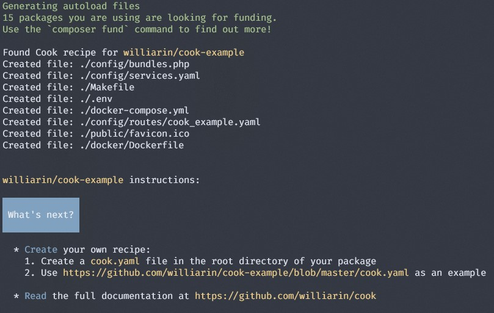

# Cook Example

Example of recipe for [Cook](https://github.com/williarin/cook).

Open the recipe file [cook.yaml](cook.yaml) to view the recipe example.

## Example project

Create a new project with:

```
mkdir cook-project && cd cook-project
composer require williarin/cook williarin/cook-example
```

Answer `[yes]` when asked to add Cook as a composer plugin.

The installation will end with this screen:


## License

[MIT](LICENSE)

Copyright (c) 2023, William Arin
